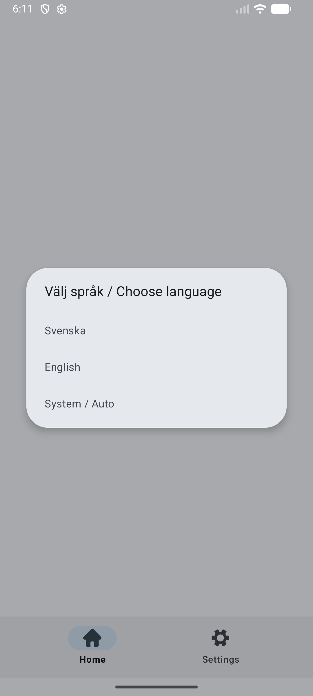
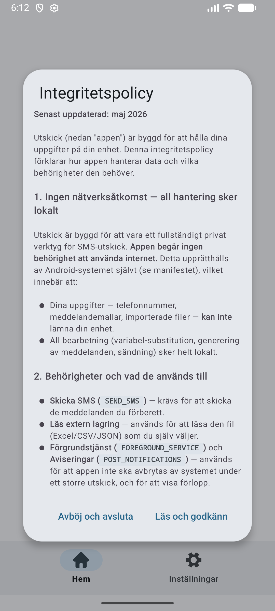
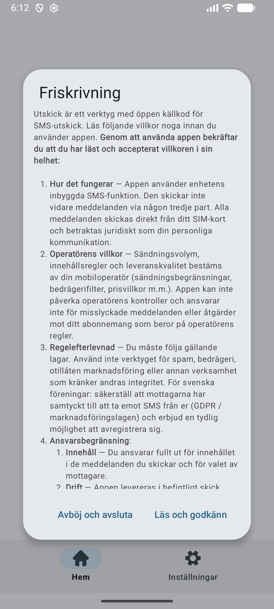
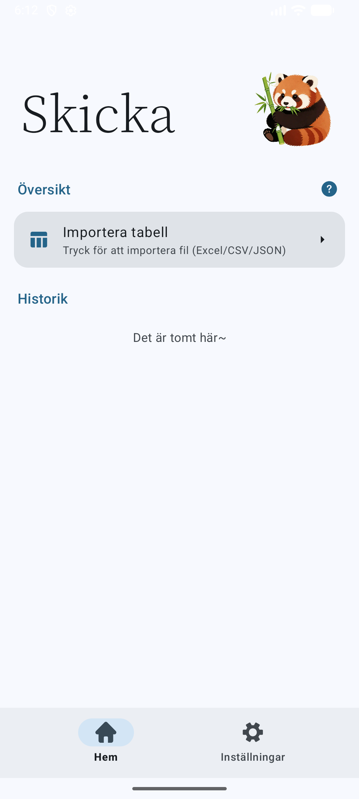
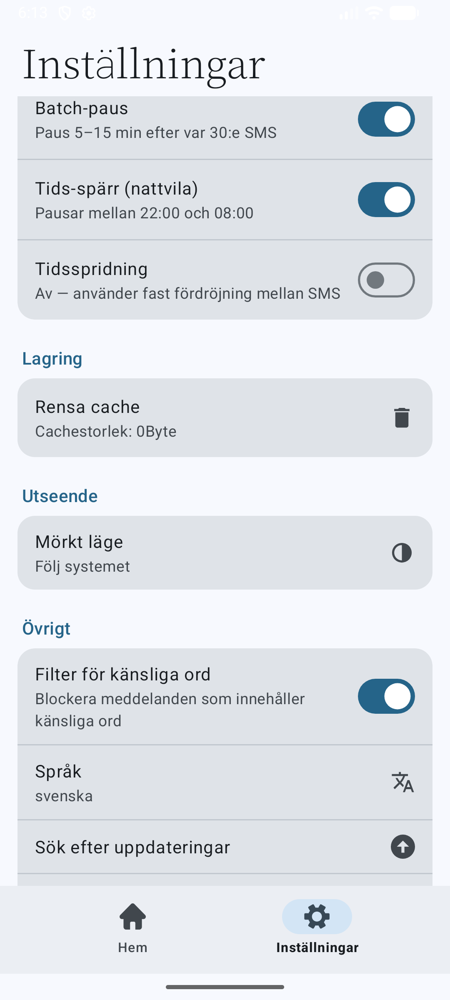
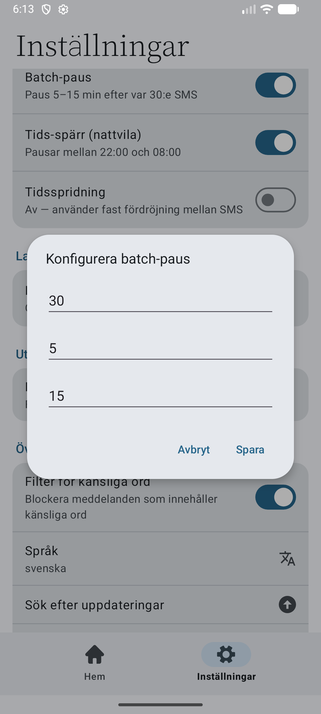

# Utskick

> SMS-utskick för svenska föreningar — utan spårning, utan moln, utan att din medlemslista lämnar telefonen.

[](LICENSE)
[](#)
[](#privacy-f%C3%B6rst--inte-i-efterhand)
[](https://github.com/SpankulatorX/Utskick/releases/latest)

## ⬇️ Ladda ner appen

> **[Senaste APK från GitHub Releases](https://github.com/SpankulatorX/Utskick/releases/latest)** — välj `Utskick-X.Y.Z-universal.apk`.

På din Android-telefon:

1. Tryck på den nedladdade APK-filen
2. Säg ja till "tillåt installation från okänd källa" (engångsfråga)
3. Tryck **Installera**
4. Vid första start: välj språk, läs igenom integritetspolicy och friskrivning, godkänn `Skicka SMS`-behörigheten

Inga utvecklarkunskaper behövs. Funkar på GrapheneOS och vanlig Android 8+.

**Verifiera APK-signaturen** (rekommenderas):

```
apksigner verify --print-certs Utskick-X.Y.Z-universal.apk
```

Förväntad signaturägare:

```
Signer #1 certificate DN: CN=Jonas Millard, O=Utskick, C=SE
```

SHA-256 för varje release publiceras i [release-anteckningarna](https://github.com/SpankulatorX/Utskick/releases). Samma signeringsnyckel används för alla framtida versioner — om SHA-256 av certifikatet (inte APK:n) ändras mellan versioner är något fel.

---

## Privacy först — inte i efterhand

Utskick är byggd med en princip: **din data lämnar aldrig telefonen.**

Det är inte ett löfte i en integritetspolicy. Det är en *teknisk* garanti, upprätthållen av Android-systemet självt:

> **Appen begär ingen behörighet att använda internet.**
> Ingen `INTERNET`. Ingen `ACCESS_NETWORK_STATE`.
> Android-sandboxen blockerar all nätverkstrafik från processer utan dessa behörigheter.

Det innebär att:

- Telefonnummer, namn, importerade filer och meddelandemallar **kan inte** skickas någonstans, inte ens om appen ville.
- Det finns **inga** spårare, ingen analys, inga annons-SDK:er, ingen telemetri, ingen "phone home"-funktion.
- Det finns **ingen** kontoinloggning. Du har inget konto. Vi (och alla andra) har ingenting om dig.
- Allt — variabel-substitution, generering av meddelanden, sändning — sker lokalt på din enhet.

Verifiera själv: kolla [`AndroidManifest.xml`](app/src/main/AndroidManifest.xml). Det enda appen ber om är behörigheter den behöver för att skicka SMS.

| Behörighet                | Används till                                     |
| ------------------------- | ------------------------------------------------ |
| `SEND_SMS`                | Skicka SMS — kärnfunktionen                      |
| `READ_SMS` / `RECEIVE_*`  | Ta emot leveranskvittenser från operatören       |
| `POST_NOTIFICATIONS`      | Visa progress-avisering under utskick            |
| `FOREGROUND_SERVICE*`     | Tillåt appen jobba i bakgrunden under utskicket  |
| `VIBRATE`                 | Vibration vid avisering                          |

`READ_PHONE_STATE` (som ofta visas vilseledande som "tillgång att ringa telefonsamtal") är **borttaget** — appen använder enhetens standard-SIM utan att läsa SIM-information.

---

## Skärmdumpar

<table>
<tr>
<td width="33%"><br/><sub><b>1.</b> Språkval först — innan något annat visas</sub></td>
<td width="33%"><br/><sub><b>2.</b> Integritetspolicy på valt språk, utan referenser till tredjepartsappar</sub></td>
<td width="33%"><br/><sub><b>3.</b> Friskrivning med GDPR-relevant information för svenska föreningar</sub></td>
</tr>
<tr>
<td width="33%"><br/><sub><b>4.</b> Hemskärm — importera medlemslista, redigera SMS, skicka</sub></td>
<td width="33%"><br/><sub><b>5.</b> Inställningar med dedikerad sektion för anti-spam-skydd</sub></td>
<td width="33%"><br/><sub><b>6.</b> Batch-paus konfigurerbar — försvarar mot Androids egen rate-limiter</sub></td>
</tr>
</table>

---

## Funktioner

### Importera medlemslista
- **Excel** (`.xls`, `.xlsx`) — direkt från föreningens medlemsregister
- **CSV** (`.csv`, `.tsv`, `.txt`) — auto-detektering av separator (`,`, `;`, tab) och UTF-8 BOM
- **JSON** (`.json`) — array av objekt med konsekventa nycklar

Första raden / objektets nycklar blir kolumnrubriker. En kolumn pekas ut som telefonnummer; övriga kan användas som variabler i mallen.

### Personaliserade meddelanden
Skriv en mall med variabler från din importerade data:

```
Hej ${Namn}! Mötet på torsdag flyttas till ${Plats}.
Vänliga hälsningar, styrelsen.
```

Varje mottagare får ett unikt meddelande — vilket är det viktigaste enskilda skyddet mot operatörens spam-filter.

### Anti-spam-skydd

Tre lager som arbetar tillsammans för att hålla utskicken under operatörens fair-use-radar:

1. **Per-SMS-fördröjning** (1–8 s, slumpmässig om så önskas) — undviker burst-mönster
2. **Batch-paus** — efter t.ex. var 30:e SMS, vänta 5–15 min slumpmässigt. Direkt skydd mot Androids inbyggda rate-limiter (~30 SMS / 30 min).
3. **Tids-spärr (nattvila)** — vägrar skicka mellan användardefinierade tider (default 22:00–08:00). Mänskligt mönster, inte bot.
4. **Tidsspridning** — för stora listor, sprid utskicket över flera timmar. T.ex. 200 SMS över 4 h ≈ 72 sek mellan varje.

Alla parametrar är konfigurerbara per förening.

### Övrigt
- **Material 3 design** — modernt, OLED-vänligt mörkt läge
- **Multi-SIM-stöd är borttaget** för att undvika `READ_PHONE_STATE` — använder enhetens standard-SIM
- **Svenska & engelska** — språkval vid första start, ändras när som helst i inställningarna
- **GDPR by design** — ingen extern dataöverföring, ingen lagring utöver appens privata cache, "Rensa cache" raderar allt

---

## Bygga från källkod

Förutsättningar:
- JDK 17 eller 21
- Android SDK med `build-tools 35+` och `platforms;android-36`
- Gradle hanteras av wrappern (`./gradlew`)

```bash
git clone https://github.com/SpankulatorX/Utskick.git
cd Utskick
echo "sdk.dir=$ANDROID_HOME" > local.properties
./gradlew assembleDebug
```

Färdig APK hamnar i `app/build/outputs/apk/debug/Utskick-3.9-universal-unsigned.apk`.

För release-bygge: skapa en signing keystore och konfigurera `signingConfigs` i `app/build.gradle`. Se [Android-dokumentationen](https://developer.android.com/studio/publish/app-signing) för detaljer.

---

## Installation på GrapheneOS / Android

1. Aktivera **Installera okända appar** för din filhanterare i Androids inställningar
2. Kopiera APK:n till telefonen (USB, syncthing, e-post — vad som funkar för dig)
3. Tryck på filen för att installera
4. Vid första start, godkänn `Skicka SMS`-behörigheten

Appen är testad på GrapheneOS men använder bara standard-Android-API:er, så den fungerar på vanlig Android också.

---

## Krediter

Utskick är en fork av **[MsgGo](https://github.com/yztz/MsgGo)** (GPL-3.0) av [yztz](https://github.com/yztz). Den ursprungliga arkitekturen — sändningsmotorn, mall-systemet, file-pickern — är yztz arbete. Tack.

Anpassningar för svenska föreningar (svensk översättning, CSV/JSON-import, språkval först, borttagning av telefonbehörighet, anti-spam-skydd) av **Jonas Millard**.

---

## Licens

GPL-3.0 — se [LICENSE](LICENSE). Forken behåller ursprungslicensen oförändrad.

---

## English summary

Utskick is a privacy-first bulk SMS tool for Swedish associations, forked from [MsgGo](https://github.com/yztz/MsgGo). Key differentiator: **the app declares no internet permission**, so the Android sandbox itself prevents any data from leaving the device. No telemetry, no account, no analytics — verifiable by inspecting the manifest. Adds CSV/JSON import alongside Excel, Swedish translation, and anti-spam scheduling controls (batch pause, quiet hours, time spread).
